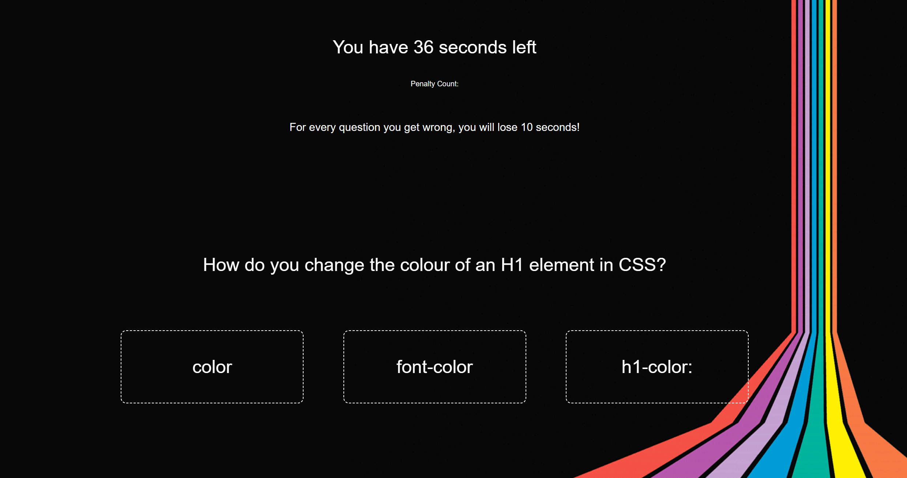
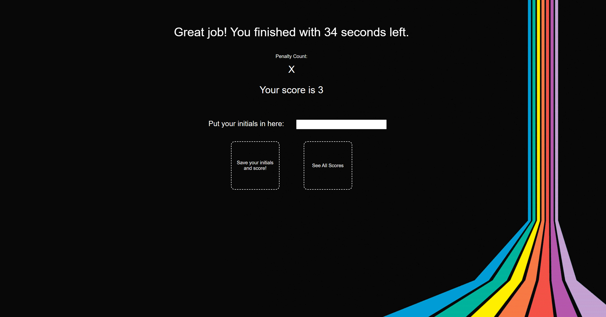

# Coding Quiz

## Description

This quiz was created for users to test their knowledge of basic coding! It consists of multiple questions which explore the topics of HTML, CSS, Javascript and related libraries. The quiz is made more exciting by being timed, and by having a penalty each tiem the user gets a question wrong (ten seconds is removed from their remaining time). In the spirit of self-improvement, users are also able to store their scores and view them later.

Below is an example of a quiz question: 

## Installation

N/A

## Usage
To use this application, please navigate to: https://p-h-davies.github.io/Password-Generator/. 

Once you have arrived at that URL, press the 'Start' button to begin the quiz. Once you answer a question, the next question will appear, until you reach the end of the question list or until the time on the timer runs out. Any penalties you incur will be visibly counted underneath the timer.

Once the quiz has been completed, you will be presented with your score, your finish time, number of penalities and the option to put your initials into a form and save your results. If there are results saved (from your current session or an earlier one), you can press the 'See all Scores' button to render a list below of the saved scores.

## Credits

Background GIF found on Pinterest - no artist credited: https://i.pinimg.com/originals/ac/68/e9/ac68e9ede5b84d83bf172fa518f03461.gif.

## License

Please refer to the LICENSE in the repo.